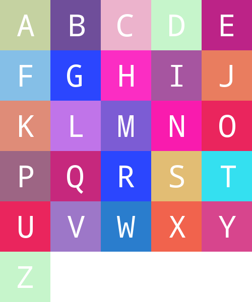

# README

A simple laravel package to generate letter avatar. I used an existing project you can see link at bottom of page.

## Installation

This is a draft so I have not yet released officialy. To add you must add the following lines to your composer.json.

```json
  "repositories": [
    {
      "type": "vcs",
      "url": "git@github.com:GentlemanOwl/LetterAvatar.git"
    }
  ],
  "require": {
    "gentleman-owl/letter-avatar": "dev-master",
  },
```

## Config

```php
php artisan vendor:publish
```

## Example

If you need to generate the image for entities use this function.

```php
$id = 33;
$name = "test";
$entity = "users";
LetterAvatar::entity($id, $name, $entity, 100, false);
```

Else you can use basics functions.

```php
LetterAvatar::generate($letter, $size)->savePng($path, $quality);
// OR
LetterAvatar::generate($letter, $size)->saveAsJpeg($path, $quality);
```

## Add new fonts

```php
# Selected font
'fontFile'   => 'droidsansmono',
# Loaded fonts
'fontFiles'  => [
    'droidsansmono' => storage_path('gentlemanowl/letter-avatar/fonts/DroidSansMono.ttf')
],
```

## Test new fonts

You can change the font used, but you may have misalignments in this case after it add your thanks to the font configuration file. You can create the following route, it will visually help correct alignments.

```php
Route::get('test', function() {
    $png = \GentlemanOwl\LetterAvatar\Facades\LetterAvatar::test();
    return response($png, 200, [
        'content-type' => 'image/png'
    ]);
});
```


To ajust your font look at your config file add use this part :

```php
    'letterCorrections' => [
        'yourfont' => [
            'letterWhoNeedToBeAjust' => [0..1]
            ...
        ]
        'droidsansmono' => [
            'L' => 0.9,
            'F' => 0.9,
            'C' => 0.9,
            'D' => 0.95,
            'E' => 0.9,
            'G' => 0.9,
            'H' => 0.95,
            'I' => 0.9,
            'J' => 0.9,
            'K' => 0.95,
            'M' => 0.95,
            'N' => 0.95,
            'O' => 0.98,
            'P' => 0.95,
            'Q' => 0.95,
            'R' => 0.95,
            'S' => 0.95,
            'U' => 0.95,
            'Z' => 0.95,
        ]
    ]
```

Original project : https://github.com/tequilarapido/letter-avatar.